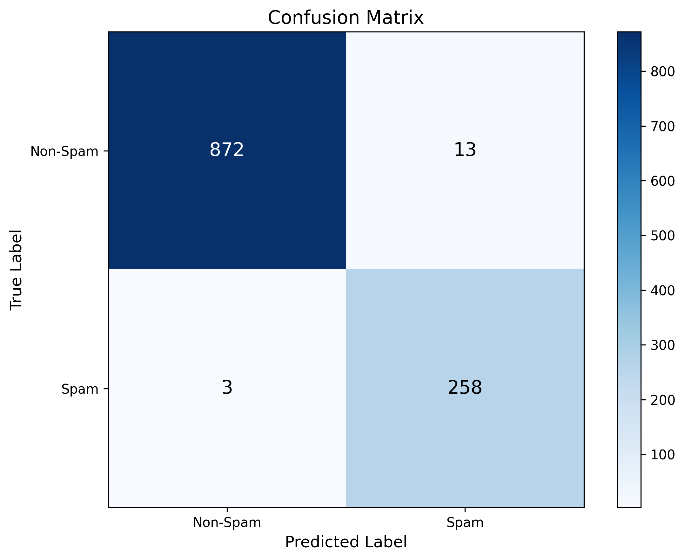
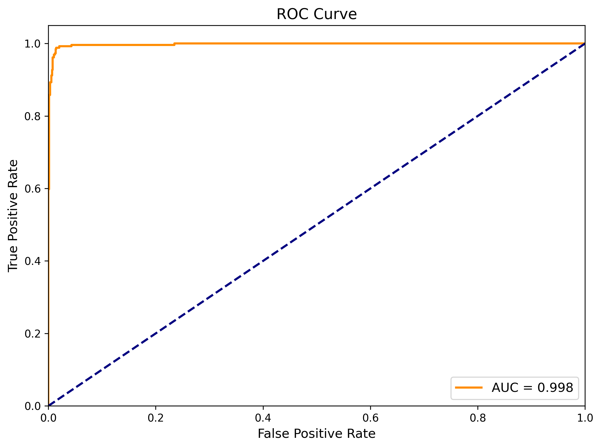
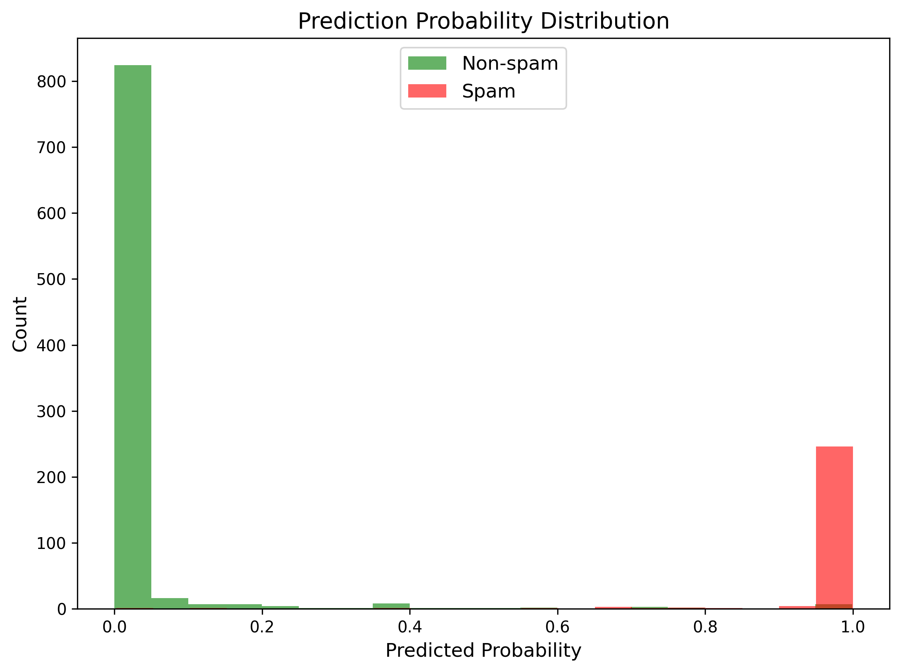

# Email Spam Classifier

A machine learning model built with PyTorch that classifies emails as spam or non-spam using natural language processing techniques.

## Project Overview

This project implements a neural network-based email classifier that can accurately detect spam emails. The model uses a combination of TF-IDF text features and engineered features to make predictions.

### Key Features

- Text preprocessing with NLTK for cleaning and normalization
- Feature engineering to extract meaningful patterns from emails
- TF-IDF vectorization for text representation
- Multi-layer neural network using PyTorch
- Balanced training to handle class imbalance
- Comprehensive evaluation metrics and visualizations

## Model Architecture

The model uses a multi-layer neural network with:

- Input layer matching feature dimensions
- Three hidden layers with ReLU activation and Batch Normalization
- Dropout regularization to prevent overfitting
- Output layer with sigmoid activation for binary classification

```text
LogisticRegressionModel(
  (model): Sequential(
    (0): Linear(input_dim -> 128)
    (1): BatchNorm1d(128)
    (2): ReLU()
    (3): Dropout(p=0.3)
    (4): Linear(128 -> 64)
    (5): BatchNorm1d(64)
    (6): ReLU()
    (7): Dropout(p=0.3)
    (8): Linear(64 -> 32)
    (9): BatchNorm1d(32)
    (10): ReLU()
    (11): Dropout(p=0.3)
    (12): Linear(32 -> 1)
  )
)
```

## Data Processing

The data pipeline includes:

1. Text cleaning (removing URLs, emails, HTML tags, etc.)
2. Feature extraction (text length, presence of URLs, punctuation, etc.)
3. TF-IDF vectorization to capture important words
4. Train-test split for evaluation

## Evaluation Results

The model's performance can be understood through several visualizations:

### Confusion Matrix



The confusion matrix shows:

- True Negatives: Correctly identified non-spam emails
- False Positives: Non-spam emails incorrectly flagged as spam
- False Negatives: Spam emails that were missed
- True Positives: Correctly identified spam emails

### ROC Curve



The Receiver Operating Characteristic (ROC) curve plots the True Positive Rate against the False Positive Rate at various threshold settings. The Area Under the Curve (AUC) measures the model's ability to distinguish between classes - a higher AUC indicates better performance.

### Precision-Recall Curve


The Precision-Recall curve shows the tradeoff between precision (positive predictive value) and recall (sensitivity) at different thresholds. This is particularly useful for imbalanced datasets where spam emails might be less common than legitimate ones.

### Probability Distribution



This histogram shows how the model distributes probability scores for spam and non-spam emails. A good model will have minimal overlap between the two distributions.

## Usage

### Training the Model

```bash
python train.py
```

This will:

1. Load and preprocess the data
2. Initialize the model
3. Train using mini-batches with class weights
4. Save the best model based on validation loss

### Evaluating the Model

```bash
python evaluate.py
```

This will:

1. Load the saved model
2. Make predictions on the test set
3. Generate evaluation metrics
4. Create visualization plots in the 'visualizations' directory

## Requirements

- Python 3.8+
- PyTorch
- NumPy
- Pandas
- Scikit-learn
- NLTK
- Matplotlib

## Project Structure

```text
EmailClassifier/
├── data/
│   └── emails.csv          # Dataset
├── visualizations/         # Generated evaluation plots
├── model.py                # Neural network architecture
├── preprocessing.py        # Data processing pipeline
├── train.py                # Model training script
├── evaluate.py             # Model evaluation script
└── README.md               # Project documentation
```
